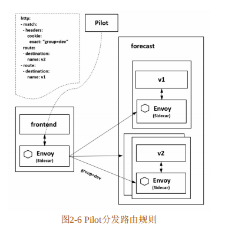
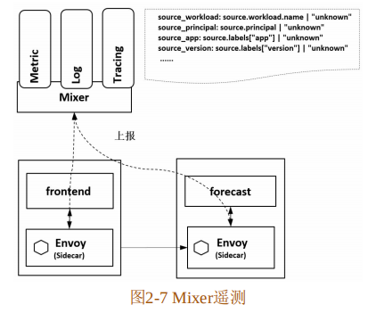
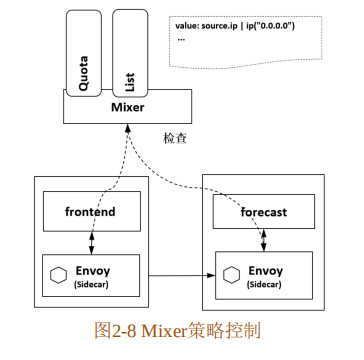
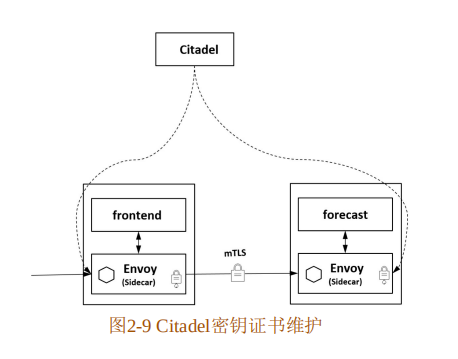
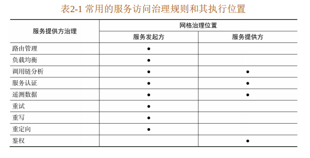
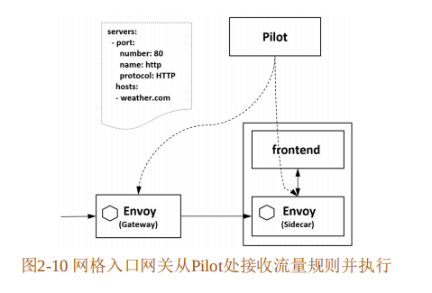

## pilot
- 1.服务发现
- 2.配置管理
-  3.流量治理

-  4.认证授权

## Mixer
从调用时 机上来说，Pilot管理的是配置数据，在配置改变时和数据面交互即可；然而，对于Mixer来说，在服务间 交互时Envoy都会对Mixer进行一次调用，因此这是一种实时管理
### 遥测数据的收集 istio-telemetry
当服务网格中有服务间互相调用时，envoy会上报遥测数据给istio-telemetry。
istio-telemetry 服务组件则根据配置将生成访问 Metric等数据分发给后端的遥测服务。数据面代理通过Report接口上报数据时访问数据会被批量上报  

### 策略的执行 istio-policy
和istio-telemetry基本上是完全相同的机制和流程。  
数据面在转发服务的请求前调用istio-policy的Check接口检查是否允许访问，Mixer 根据配置将请求转发到
对应的 Adapter 做对应检查，给代理返回允许访问还是拒绝。可以对接如配额、授权、黑白名单等不同的 控制后端，对服务间的访问进行可扩展的控制。  

### 服务认证 istio-citadel
提供了自动生成、分发、轮换与撤销密钥和证书 功能

### istio-galley 
istio-galley并不直接向数据面提供业务能力，而是在控制面上向其他组件提供支持。Galley作为负责 配置管理的组件，
验证配置信息的格式和内容的正确性，并将这些配置信息提供给管理面的 Pilot和 Mixer 服务使用，这样其他管理面组件只用和 Galley打交道，
从而与底层平台解耦。在新的版本中Galley的作用 越来越核心。  

### istio-sidecar-injector
负责向pod容器中注入sidecar。  
在 Kubernetes环境下，根据自动注入配置，Kube-apiserver在拦截到 Pod创建的请求时，
会调用自动注入服务 `istio-sidecar-injector` 生成 Sidecar 容器的描述并将其插入原 Pod的定义中.
### istio-proxy
即Envoy，Envoy是用C++开发的非常有影响力的轻量级高性能开源服务代理。
作为服务网格的数据面，Envoy 提供了动态服务发现、负载均衡、TLS、HTTP/2 及 gRPC代理、熔断器、
健康检查、流量拆分、灰度发布、故障注入等功能，本篇描述的大部分治理能力最终都落实到Envoy的实现上。  
当给forecast服务定义流量规则时，所有访问forecast服务的 Sidecar都收到规则，并且执行相同的治理逻辑，从而对目标服务执行一致的治理。    

### istio-ingressgateway
istio的网关，其实就是一个envoy，但是负责一组端口的转发和路由。和网格内的其他 Sidecar一样从 Pilot处接收流量规则并执行。  

