## Istio流量治理的概要流程如图所示
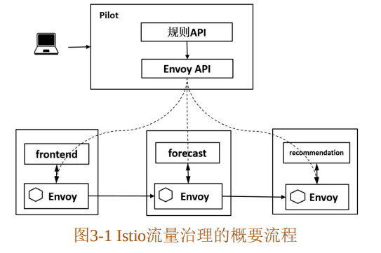
#### 在控制面会经过如下流程： 
- （1）管理员通过命令行或者API创建流量规则；
- （2）Pilot将流量规则转换为Envoy的标准格式；
- （3）Pilot将规则下发给Envoy。
#### 在数据面会经过如下流程：
- （1）Envoy拦截Pod上本地容器的Inbound流量和Outbound流量；
- （2）在流量经过Envoy时执行对应的流量规则，对流量进行治理。  

## 负载均衡
Pilot将服务发现数据通过 Envoy的标准接口下发给数据面Envoy，Envoy则根据配置的负载均衡策略选择一个实例转发请求。Istio当前支持的主要负载均衡算法包括：轮询、随机和最小连接数算法
## 熔断器
在远程调用时，请求在超时前一直挂起，会导致请求链路上的级联故障和资源耗尽；熔断器封装了被保护的逻辑，监控调用是否失败，
当连续调用失败的数量超过阈值时，熔断器就会跳闸，在跳闸后的一定时间段内，所有调用远程服务的尝试都将立即返回失败；
同时，熔断器设置了一个计时器， 当计时到期时，允许有限数量的测试请求通过；如果这些请求成功，则熔断器恢复正常操作；
如果这些请求失败，则维持断路状态。  
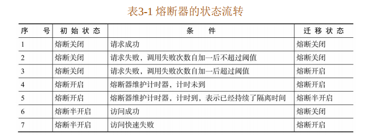
### Hystrix熔断
___Hystrix的主要功能包括：___   
- 阻断级联失败，防止雪崩； 
- 提供延迟和失败保护； 
- 快速失败并即时恢复； 
- 对每个服务调用都进行隔离； 
- 对每个服务都维护一个连接池，在连接池满时直接拒绝访问； 
- 配置熔断阈值，对服务访问直接走失败处理 Fallback 逻辑，可以定义失败处理逻辑； 
- 在熔断生效后，在设定的时间后探测是否恢复，若恢复则关闭熔断； 
- 提供实时监控、告警和操作控制。  
___缺点：___
- 1.5.18版本后不再迭代，替代者为Resilience4J
- 需要在代码里写熔断处理逻辑，会存在代码侵入
### Istio熔断
Istio 的连接池管理工作机制对 TCP 提供了最大连接数、连接超时时间等管理方式，
对HTTP提供了最 大请求数、最大等待请求数、最大重试次数、每连接最大请求数等管理方式，它控制客户端对目标服务的连接和访问，在超过配置时快速拒绝。
___连接池管理机制___
场景：限制某一客户端对目标服务的请求数、链接数，超过阈值断开链接。同时可以限制重试次数
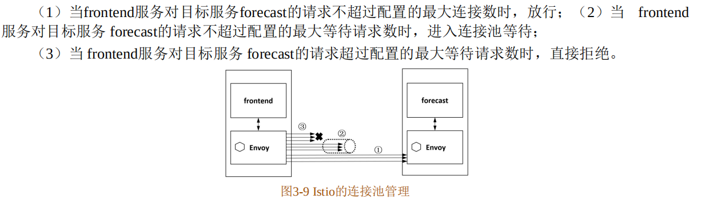
___异常点检查机制___
场景： 如果某个服务频繁超时或者出错，主动将其隔离。  
然后在服务被隔离后会定期将其解除隔离，如果解除隔离后访问正常，则认为正常；否则继续隔离。间隔时间为驱逐次数 "乘以" 一个基础时间。  
另外，在Istio中可以控制驱逐比例，即有多少比例的服务实例在不满足要求时被驱逐。当有太多实例被移除时，就会进入恐慌模式，
这时会忽略负载均衡池上实例的健康标记，仍然会向所有实例发送请求，从而保证一个服务的整体可用性。
### Istio于Hystix的熔断对比
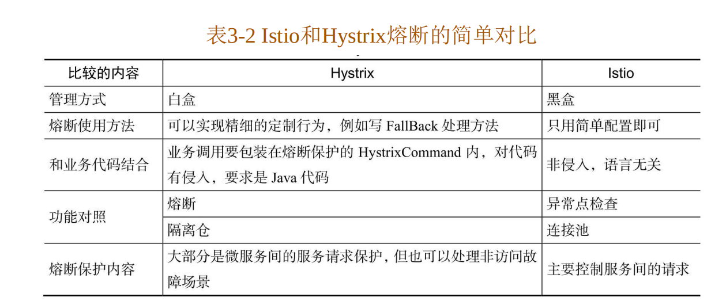

## 故障注入
一般微服务环境在上线前需要进行一些故障测试，来检测整个系统的稳定性。传统的微服务架构中需要编辑代码，在代码中模拟故障，
比如：返回503状态码、sleep线程等方式。  
Istio通过在envoy层实现故障的注入，无需侵入代码。  
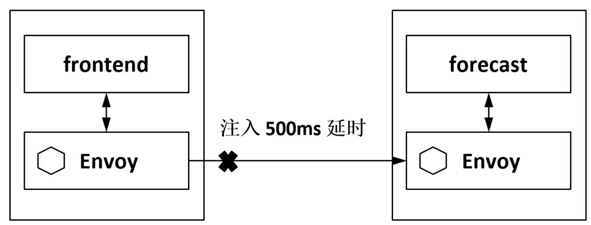
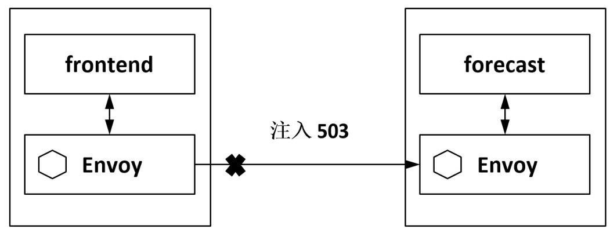  
实际上，在 Istio 的故障注入中可以对故障的条件进行各种设置，例如只对某种特定请求注入故障， 其他请求仍然正常。
## 灰度发布
### 蓝绿发布
同时发布两个版本，首先将所有流量切换到新的版本，如果没有问题，删除老版本；如果新版本存在问题，切回老版本  
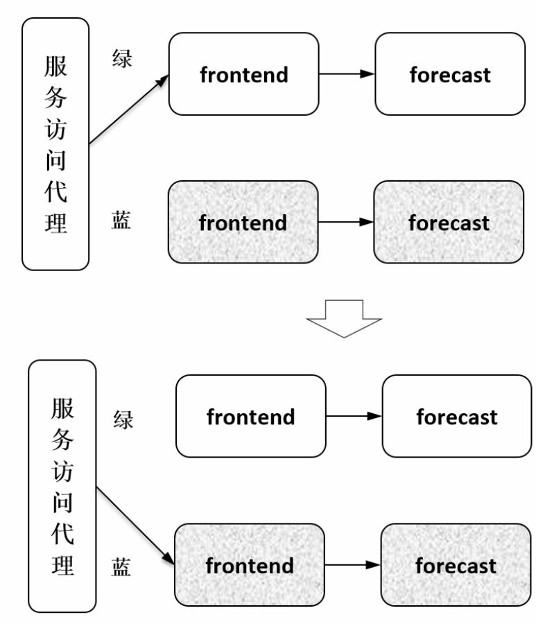  
### AB测试
按一定的目标选取策略让一部分用户使用A版本，让一部分用户使用B版本，收集这两部分用户的使用反馈，
即对用户采样后做相关比较，通过分析数据来最终决定采用哪个版本。  
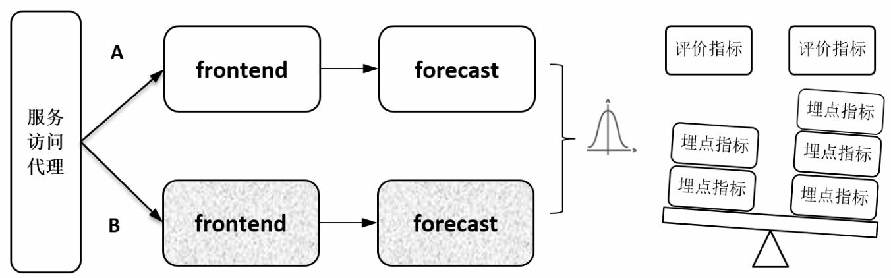
### 灰度发布
发布一个新版本，释放一部分流量到新版本，然后根据服务运行情况，调整流量。待程序完全没有问题后全部切换到新版本，做到用户无感知
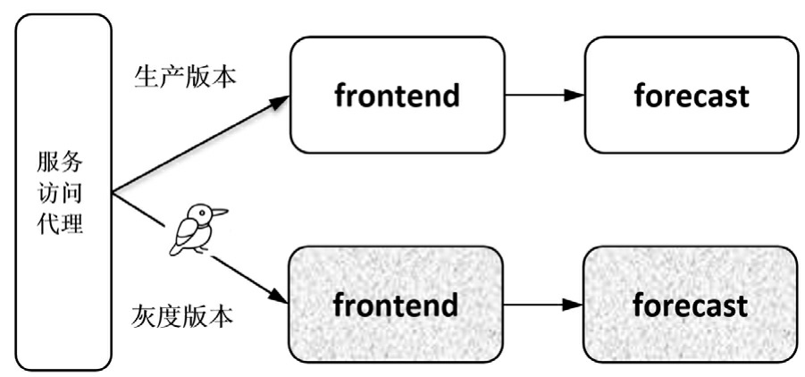
#### 1.传统微服务的灰度发布方式
传统微服务通过网关控制流量的转发，只能针对对接网关的服务。如果此服务调用了其他服务，那么其他服务的版本无法控制
#### 2.kubernetes的灰度发布方式
k8s通过调节每个服务对应的pod的数量，控制流量的分发，无法做到自由控制流量的转发。而且根据资源限制无法创建过多pod，比如想要控制流量比例为1:99，
难道要创建100个pod吗？  
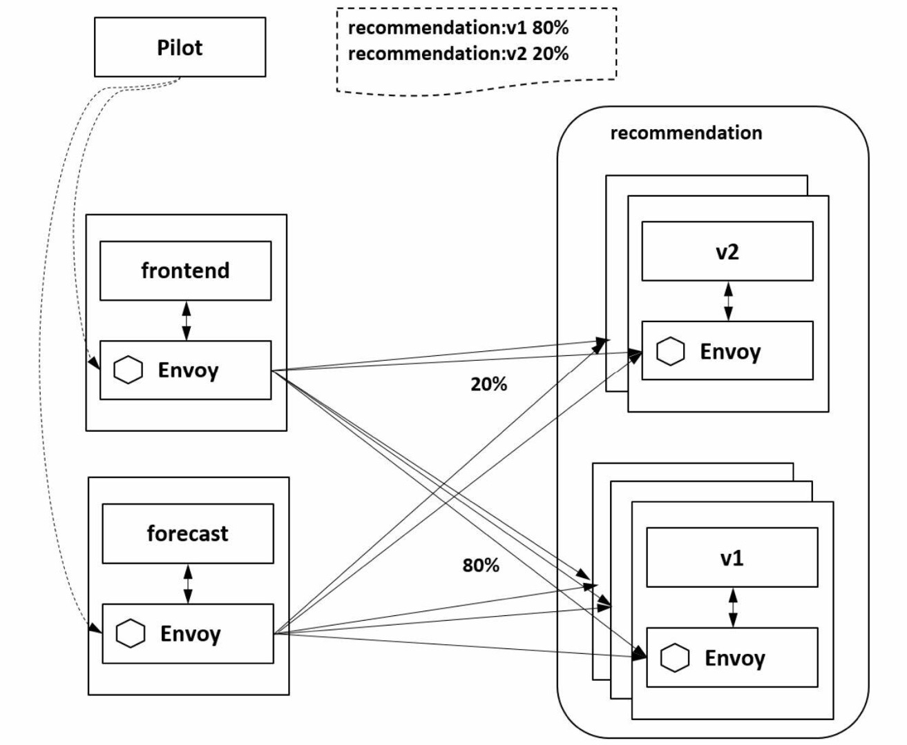
#### 3.Istio的灰度发布方式
通过在pilot中设置流量分发的规则，相关服务的envoy会获得这个规则并根据规则去进行负载均衡。进而可以实现所有调用链路上的灰度发布  
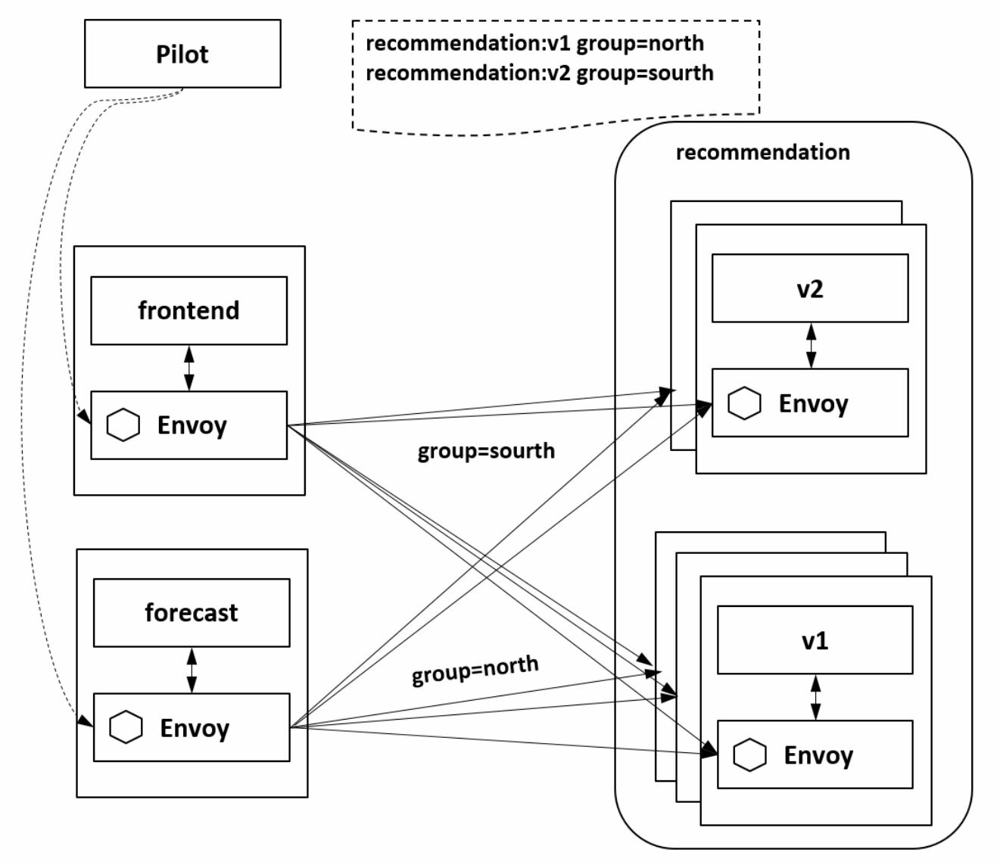
