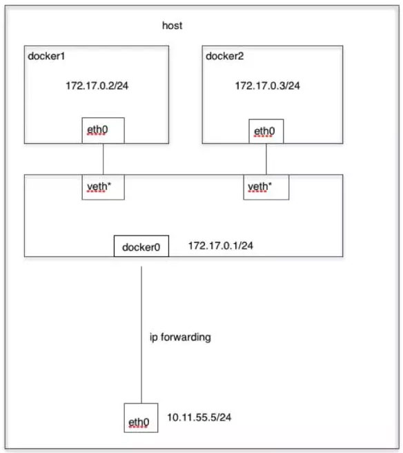

## Docker的网络模式
### 1.none
使用none模式，Docker容器拥有自己的Network Namespace，但是，并不为Docker容器进行任何网络配置。
也就是说，这个Docker容器没有网卡、IP、路由等信息。需要我们自己为Docker容器添加网卡、配置IP等。
### 2.host
如果启动容器的时候使用host模式，那么这个容器将不会获得一个独立的Network Namespace，而是和宿主机共用一个Network Namespace。容器将不会虚拟出自己的网卡，配置自己的 IP 等，
而是使用宿主机的IP和端口。但是，容器的其他方面，如文件系统、进程列表等还是和宿主机隔离的
### 3.bridge
docker默认的网络设置。  
当Docker进程启动时，会在主机上创建一个名为docker0的虚拟网桥，此主机上启动的Docker容器会连接到这个虚拟网桥上。
虚拟网桥的工作方式和物理交换机类似，这样主机上的所有容器就通过交换机连在了一个二层网络中。

### 4.container
这个模式指定新创建的容器和已经存在的一个容器共享一个 Network Namespace，而不是和宿主机共享。新创建的容器不会创建自己的网卡，配置自己的 IP，
而是和一个指定的容器共享IP、端口范围等。同样，两个容器除了网络方面，其他的如文件系统、进程列表等还是隔离的。

## Docker的dns解析
docker容器本质上也是个linux，所以dns的解析方法和linux一样，优先是找/etc/hosts文件，像localhost这种域名就是写在这个文件里.  
找完/etc/hosts文件，然后是/etc/resolv.conf文件:  
```bash
domain local
nameserver 192.168.65.1
nameserver 192.168.65.10
```
## Docker的dns设置
如果请求的是自己内网的api, 可以直接修改/etc/hosts文件，如果是外网的请求可以通过更改/etc/resolv.conf里的nameserver实现。  
docker容器肯定不是直接通过修改文件实现的，可以通过run的命令实现:
```bash
# 添加host
docker run --name app --add-host='api.embbnux.com:10.98.10.98' -d ubuntu
# 指定dns server
docker run --name app --dns=223.5.5.5 --dns=8.8.8.8 -d ubuntu
```

