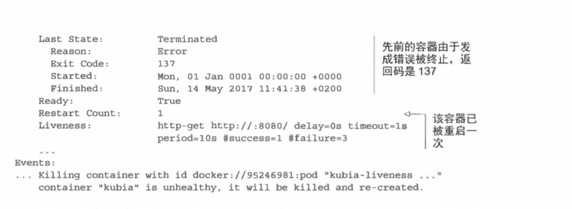

## Docker命令
1.删除悬空镜像（镜像名称或者tag为空的镜像）  
```docker rmi $(docker images -f "dangling=true" -q)```  
2.进入容器
```
docker exec -it 容器id /bin/bash
```
3. 创建容器
```
docker build -t 容器名:容器tag .
. 表示当前文件夹下的Dockerfile文件
```
4. 运行容器
```
docker run -it -p 32001:8080 console:1.0
32001:映射到宿主机上的ip地址
8080：Dockerfile里面释放的地址
console：容器名称
1.0：容器tag
```
5. 从容器中copy文件到宿主机
```
docker cp 7ec8d55dcc43:/usr/local/tomcat/bin/catalina.sh ./catalina.sh
7ec8d55dcc43: 容器id
/usr/local/tomcat/bin/catalina.sh：容器中文件的全路径
./catalina.sh：宿主机文件的相对路径
```
## K8S命令
+ 查看一个pod的信息，以yaml/json格式展示
```
 kubectl get po kubia-zxzij -o yaml 
 kubectl get po kubia-zxzij -o json 
```
+ 查看某个参数的定义，或者用法、参数等  
```
kubectl explain pods 
kubectl explain pod.spec 
```
+ 根据yaml文件或者json文件创建k8s对象（pod、deployment等）
```
kubect1 create -f kubia-manual.yaml 
```
+ 使用kubectl获取容器日志
```
pod中单容器
kubectl logs podname 
pod中多容器
kubectl logs podname -c contaionername
```
+ 根据标签查询pod  
```
查询包含env标签的pod
kubectl get po -l env
查询不包含env标签的pod
kubectl get po -l '!env'
题外话：标签可以被附加给任何kubernetes的对象上，包括node
```
+ 查看重启容器后的pod描述
```
kubectl describe po podname 
```
得到结果如下
  

###
+ 在pod中执行一个sh命令
```bash
kubectl exec kubia-7nogl -- curl -s http: //10 .111. 249 .153
```
+ 在pod中执行shell脚本
```bash
kubectl exec -it kubia-3inly bash
```
