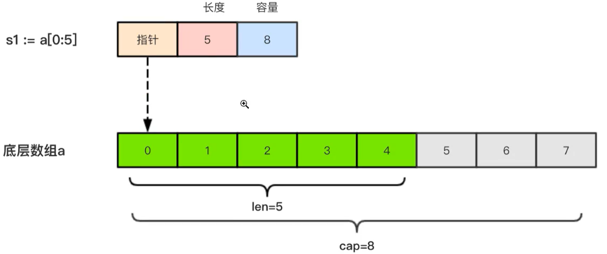
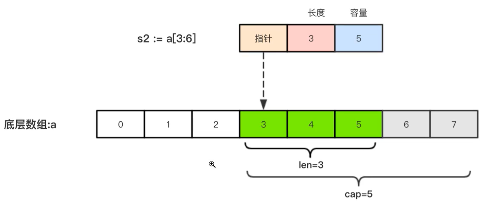

切片是拥有相同类型的可变长度的序列。（感觉还是java中的数组，是一块连续的内存）
初始化 `vat a []int`，初始化没赋值的切片是空的，golang中用`nil`表示`null`    
- 切片的底层就是数组
- 切片的长度就是元素的数量
- 切片的容量就是底层数组的第一个元素，到底层数组的最后一个元素的数量，参考
切片 `s1:=a[0:5]`

切片 `s2:=a[3:6]`

### 由数组得到切片
获取原则为左闭右开，即包含[]中左边的不包含[]中右边的。   
```go
func main() {
	a := [...]int{1, 2, 3, 4, 5, 6, 7}

	b1 := a[0:4]
	fmt.Println(b1)
	b2 := a[:4]
	fmt.Println(b2)
	b3 := a[1:]
	fmt.Println(b3)
	b4 := a[:]
	fmt.Println(b4)
}
```
结果
```bash
D:\goProgect\src\github.com\yechen\day01>go run helloworld.go
[1 2 3 4]
[1 2 3 4]
[2 3 4 5 6 7]
[1 2 3 4 5 6 7]
```
注意：切片的长度是固定的，不能使用超出其长度，这点与java中的集合不同，此种方式创建的切片不会自动扩缩容
### 通过函数创建切片
make(Type,len,cap)
```go
a := make([]int, 5, 10)
```
### 注意
切片是引用类型。如果修改了一个切片的值，那么底层数组也会变化，所有指向此数组的切片的值都会变化。
### 切片的扩容
使用append函数进行扩容，方法如下
```go
func main() {
	a := make([]int, 5)
	fmt.Printf("a: %v,len(a):%d,cap(a):%d\n", a, len(a), cap(a))
	a = append(a, 1314)
	fmt.Printf("a: %v,len(a):%d,cap(a):%d\n", a, len(a), cap(a))
}
```
输出结果：
```sh
D:\goProgect\src\github.com\yechen\day01>go run helloworld.go
a: [0 0 0 0 0],len(a):5,cap(a):5
a: [0 0 0 0 0 1314],len(a):6,cap(a):10
```
切片的扩容策略（....）  
将一个切片追加到另一个切片上
```go
func main() {
	a := make([]int, 5)
	b := []int{12, 13, 14, 15}
    // ...表示将切片拆开
	a = append(a, b...)
	fmt.Printf("a: %v,len(a):%d,cap(a):%d\n", a, len(a), cap(a))
}
```
输出结果
```bash
D:\goProgect\src\github.com\yechen\day01>go run helloworld.go
a: [0 0 0 0 0 12 13 14 15],len(a):9,cap(a):10
```
### 复制切片
```go
func main() {
	a := []int{12, 13, 14, 15}
	b := make([]int, 4)
	copy(b, a)
	fmt.Println(b)
}
```
输出结果
```bash
D:\goProgect\src\github.com\yechen\day01>go run helloworld.go
[12 13 14 15]
```
### 删除切片中元素的方法
go语言中没有删除切片元素的方法，可以通过其他方式实现：
```go
func main() {
	a := []int{12, 13, 14, 15}

	a = append(a[:2], a[3:]...)
	fmt.Println(a)
}
```
输出结果
```bash
D:\goProgect\src\github.com\yechen\day01>go run helloworld.go
[12 13 15]
```
### 数组的排序
可以直接使用`sort`函数进行排序
```go
func main() {
	a := []int{16, 12, 17, 15}
	fmt.Println(a)
	sort.Ints(a)
	fmt.Println(a)
}
```
