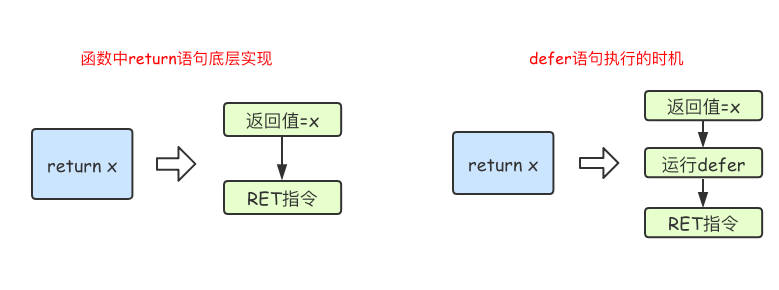

## 函数定义
Go语言中定义函数使用func关键字，具体格式如下：
```go
func 函数名(参数)(返回值){
    函数体
}
```
### 类型简写
函数的参数中如果相邻变量的类型相同，则可以省略类型，例如：
```go
func intSum(x, y int) int {
	return x + y
}
```
### 可变参数
此处与java中的可变参数使用方式相同  
可变参数是指函数的参数数量不固定。Go语言中的可变参数通过在参数名后加`...`来标识。    
注意：可变参数通常要作为函数的最后一个参数。
```go
func intSum2(x ...int) int {
	fmt.Println(x) //x是一个切片
	sum := 0
	for _, v := range x {
		sum = sum + v
	}
	return sum
}
```
使用方式
```go
ret1 := intSum2()
ret2 := intSum2(10)
ret3 := intSum2(10, 20)
ret4 := intSum2(10, 20, 30)
fmt.Println(ret1, ret2, ret3, ret4) //0 10 30 60
```
### 返回值
Go语言中函数支持多返回值，函数如果有多个返回值时必须用()将所有返回值包裹起来。
```go
func calc(x, y int) (int, int) {
	sum := x + y
	sub := x - y
	return sum, sub
}
```
函数定义时可以给返回值命名，并在函数体中直接使用这些变量，最后通过return关键字返回。
```go
func calc(x, y int) (sum, sub int) {
	sum = x + y
	sub = x - y
	return
}
```
## 函数类型与变量
可以将函数定义为一个变量类型，这个变量可以作为其他函数的参数或者返回值。（此处算是go语言的一个特性，至少之前没有见过。。）
### 定义函数类型
我们可以使用type关键字来定义一个函数类型，具体格式如下：  
`type calculation func(int, int) int`  
上面语句定义了一个calculation类型，它是一种函数类型，这种函数接收两个int类型的参数并且返回一个int类型的返回值。  
简单来说，凡是满足这个条件的函数都是calculation类型的函数，例如下面的add和sub是calculation类型。
```go
func add(x, y int) int {
	return x + y
}

func sub(x, y int) int {
	return x - y
}
```
add和sub都能赋值给calculation类型的变量。
```go
var c calculation
c = add
```
也可以使用简略方式进行赋值
```go
f := add
```
## 高阶函数
### 函数作为参数
函数可以作为参数：
```go
func add(x, y int) int {
	return x + y
}
func calc(x, y int, op func(int, int) int) int {
	return op(x, y)
}
func main() {
	ret2 := calc(10, 20, add)
	fmt.Println(ret2) //30
}
```
PS:感觉像是java中的设计模式。。
### 函数作为返回值
```go
func do(s string) (func(int, int) int, error) {
	switch s {
	case "+":
		return add, nil
	case "-":
		return sub, nil
	default:
		err := errors.New("无法识别的操作符")
		return nil, err
	}
}
```
### 匿名函数
函数当然还可以作为返回值，但是在Go语言中函数内部不能再像之前那样定义函数了，只能定义匿名函数。匿名函数就是没有函数名的函数，匿名函数的定义格式如下：  
```go
func(参数)(返回值){
    函数体
}
```
匿名函数因为没有函数名，所以没办法像普通函数那样调用，所以匿名函数需要保存到某个变量或者作为立即执行函数:
```go
func main() {
	// 将匿名函数保存到变量
	add := func(x, y int) {
		fmt.Println(x + y)
	}
	add(10, 20) // 通过变量调用匿名函数

	//自执行函数：匿名函数定义完加()直接执行
	func(x, y int) {
		fmt.Println(x + y)
	}(10, 20)
}
```
匿名函数多用于实现回调函数和闭包
### 闭包
闭包指的是一个函数和与其相关的引用环境组合而成的实体。简单来说，`闭包=函数+引用环境`。 首先我们来看一个例子：
```go
func adder() func(int) int {
	var x int
	return func(y int) int {
		x += y
		return x
	}
}
func main() {
	var f = adder()
	fmt.Println(f(10)) //10
	fmt.Println(f(20)) //30
	fmt.Println(f(30)) //60

	f1 := adder()
	fmt.Println(f1(40)) //40
	fmt.Println(f1(50)) //90
}
```
变量f是一个函数并且它引用了其外部作用域中的x变量，此时f就是一个闭包。 在f的生命周期内，变量x也一直有效。  
闭包进阶示例1：
```go
func adder2(x int) func(int) int {
	return func(y int) int {
		x += y
		return x
	}
}
func main() {
	var f = adder2(10)
	fmt.Println(f(10)) //20
	fmt.Println(f(20)) //40
	fmt.Println(f(30)) //70

	f1 := adder2(20)
	fmt.Println(f1(40)) //60
	fmt.Println(f1(50)) //110
}
```
闭包进阶示例2：
```go
func makeSuffixFunc(suffix string) func(string) string {
	return func(name string) string {
		if !strings.HasSuffix(name, suffix) {
			return name + suffix
		}
		return name
	}
}

func main() {
	jpgFunc := makeSuffixFunc(".jpg")
	txtFunc := makeSuffixFunc(".txt")
	fmt.Println(jpgFunc("test")) //test.jpg
	fmt.Println(txtFunc("test")) //test.txt
}
```
闭包进阶示例3：
```go
func calc(base int) (func(int) int, func(int) int) {
	add := func(i int) int {
		base += i
		return base
	}

	sub := func(i int) int {
		base -= i
		return base
	}
	return add, sub
}

func main() {
	f1, f2 := calc(10)
	fmt.Println(f1(1), f2(2)) //11 9
	fmt.Println(f1(3), f2(4)) //12 8
	fmt.Println(f1(5), f2(6)) //13 7
}
```
## defer语句
Go语言中的`defer`语句会将其后面跟随的语句进行延迟处理。
在`defer`归属的函数即将返回时，将延迟处理的语句按`defer`定义的逆序进行执行，也就是说，先被`defer`的语句最后被执行，
最后被`defer`的语句，最先被执行。  
举个例子：
```go
func main() {
	fmt.Println("start")
	defer fmt.Println(1)
	defer fmt.Println(2)
	defer fmt.Println(3)
	fmt.Println("end")
}
```
输出结果： 
```bash
start
end
3
2
1
```
由于`defer`语句延迟调用的特性，所以`defer`语句能非常方便的处理资源释放问题。比如：资源清理、文件关闭、解锁及记录时间等。
### defer执行时机
在Go语言的函数中return语句在底层并不是原子操作，它分为给返回值赋值和RET指令两步。
而defer语句执行的时机就在返回值赋值操作后，RET指令执行前。具体如下图所示：


### 内置函数介绍

|    内置函数    |                             介绍                             |
| :------------: | :----------------------------------------------------------: |
|     close      |                     主要用来关闭channel                      |
|      len       |      用来求长度，比如string、array、slice、map、channel      |
|      new       | 用来分配内存，主要用来分配值类型，比如int、struct。返回的是指针 |
|      make      |   用来分配内存，主要用来分配引用类型，比如chan、map、slice   |
|     append     |                 用来追加元素到数组、slice中                  |
| panic和recover |                        用来做错误处理                        |

### panic/recover

Go语言中目前（Go1.12）是没有异常机制，但是使用`panic/recover`模式来处理错误。 `panic`可以在任何地方引发，但`recover`只有在`defer`调用的函数中有效。 首先来看一个例子：

```go
func funcA() {
	fmt.Println("func A")
}

func funcB() {
	panic("panic in B")
}

func funcC() {
	fmt.Println("func C")
}
func main() {
	funcA()
	funcB()
	funcC()
}
```

输出：

```bash
func A
panic: panic in B

goroutine 1 [running]:
main.funcB(...)
        .../code/func/main.go:12
main.main()
        .../code/func/main.go:20 +0x98
```

程序运行期间`funcB`中引发了`panic`导致程序崩溃，异常退出了。这个时候我们就可以通过`recover`将程序恢复回来，继续往后执行。

```go
func funcA() {
	fmt.Println("func A")
}

func funcB() {
	defer func() {
		err := recover()
		//如果程序出出现了panic错误,可以通过recover恢复过来
		if err != nil {
			fmt.Println("recover in B")
		}
	}()
	panic("panic in B")
}

func funcC() {
	fmt.Println("func C")
}
func main() {
	funcA()
	funcB()
	funcC()
}
```

**注意：**

1. `recover()`必须搭配`defer`使用。
2. `defer`一定要在可能引发`panic`的语句之前定义。

---

此处参考链接地址：https://www.liwenzhou.com/posts/Go/09_function/

