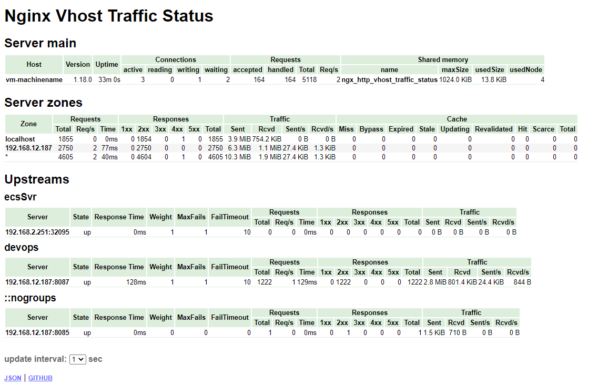

#### 1.下载nginx对应版本的nginx-module-vts，并安装
下载nginx-module-vts到nginx所在服务器，解压后重新编译nginx
```bash
tar -xvf nginx-1.15.7.tar.gz
cd nginx-1.15.7
./configure --add-module=/usr/local/nginx-module-vts-master/
make && make install
```
#### 2.配置nginx-module-vts
编辑nginx.conf
分别在http标签和server标签中添加以下配置
```conf
http {
vhost_traffic_status_zone;
vhost_traffic_status_filter_by_host on; 
 
	server { 
		vhost_traffic_status off;			 
		location /status {
			vhost_traffic_status_display;
			vhost_traffic_status_display_format html;
		}
	}
}
```
配置说明
```
配置详解：1、打开vhost过滤：vhost_traffic_status_filter_by_host on;
开启此功能，在Nginx配置有多个server_name的情况下，会根据不同的server_name进行流量的统计，否则默认会把流量全部计算到第一个server_name上。
2、在不想统计流量的server区域禁用vhost_traffic_status，配置示例：
server {
…
vhost_traffic_status off;
…
}
3、假如nginx没有规范配置server_name或者无需进行监控的server上，那么建议在此vhost上禁用统计监控功能。否则会出现“127.0.0.1”，hostname等的域名监控信息
```

重启nginx，然后访问 /status查看是否有结果,出现以下界面证明安装成功
 
#### 3.启动exporter
```bash
docker run -d --env NGINX_STATUS="http://192.168.12.187/status/format/json" -p 9913:9913 --restart=always --name=nginx-vts-exporter sophos/nginx-vts-exporter
```
#### 4.配置grafana
grafana的面板id为 2949

