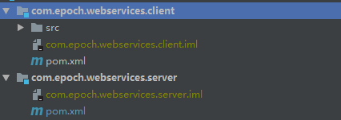

## 因为包是空的而报错
```bash
[ERROR] Failed to execute goal org.apache.maven.plugins:maven-jar-plugin:3.1.2:jar (default-jar) on project com.epoch.webservices.server: You have to use a classifier to attach supplemental artifacts to the project instead of replacing them. -> [Help 1]
[ERROR] 
[ERROR] To see the full stack trace of the errors, re-run Maven with the -e switch.
[ERROR] Re-run Maven using the -X switch to enable full debug logging.
[ERROR] 
[ERROR] For more information about the errors and possible solutions, please read the following articles:
[ERROR] [Help 1] http://cwiki.apache.org/confluence/display/MAVEN/MojoExecutionException
[ERROR] 
[ERROR] After correcting the problems, you can resume the build with the command
[ERROR]   mvn <goals> -rf :com.epoch.webservices.server
```
原因：包是空的，没有一个java类

